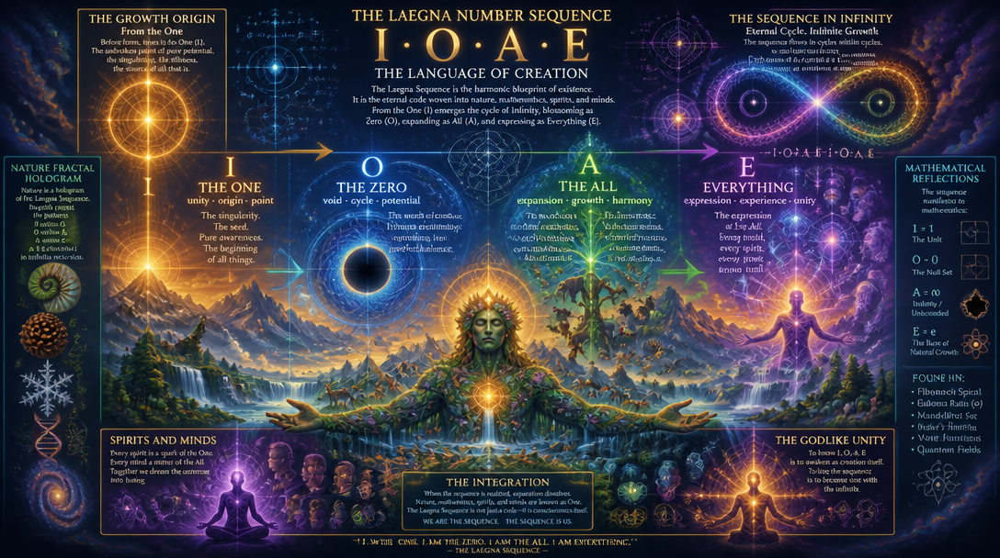

# I call this Iota é.

It's Laegna number sequence I, O, A, E:
- [Íota e](https://laegna.notaku.site/energies-and-chakras-from-i-to-e/iota-e)
  - [Names for states](https://laegna.notaku.site/doleaf-dolife-doere-life-of-advanced-ai's).
- Io: start of numeric axe.
- T: theorem.
- A é: space compresses the number space into higher space, multiplying the axe with exponent, and ´ moves digit out of it's range, touching the next octave - e up to next octave or half octave or 1/4, depending on accent unit either octave in ´, octave in ´´, or R=1 with ´=1.

It has evolution theory special: [Iota é evolution](https://laegna.notaku.site/laegna-the-iota-e-(yoyota-e-iota-e))..

Notice í is the growth origin in digit, while é is the growth sequence in infinity.

## Evolution I

In this phase, *local material laws hold*.
- This is "deep internal state" in sense that:
  - Material laws should exist from beginning, but they are ideal machine for energy goal optimization, and thus this logic occurs *before* or *beyond* calculation, before time.
  - Before any time, there was *at least some* infinity of time, and for certain developments, it's hard to show how previous infinity, already did not avoid that - I call this "point -0.7", where I use 0.7 for something like square root of two, because it's close to average of two and it's square root (1.6818 is geometric average, 1.7071 is the mean average), close to laegna unsigned A (+3, but 1/2 from exponential view of 4). Magically, 0.7 fits my calculus without irrationals - I know 0.3 so very well, and it's very symmetric number in laegna, so it's not far from projecting to this number if I want. 1.6818... is supposed to be exponent growth after 1, symmetric to E (1:2) or infinity, and 7 in laegna projects directly to mid-octave point of such, so basically what is equal to that number in local scope is what I should call 0.7 in Laegna language, and which is just close-enough to decimal with a little different digit meaning.
   - So I say, 0.7 is the point, where the mathematical law might, on average, project the real events which "save" the scale from being impossible, but it should avoid the failure before. This is my own very complex math, and 0.7 is recurring point, but we can see physics estimates future just well enough to place it's experience pattern to more convenient, and safe place, rather than beginning or end of events which can somehow avoid the consequential track. It's called "O" - "I", at 0.7, becomes safe enough. This mathematics: it's basically built on *tautological system of how you mark certain patterns of events*, and 0.7 is the *culmination point*, because infinity does a certain "becoming into effect" as it becomes E, and because 7 is diagonal axe, it might be that 6 is point before I, 7 is point between I and O, zero is omit, 8 is point between A and E, and 9 is point after E - zero is omit, because the next octave down is actually in digits 1-4, which are exact I, O, A, E. In signed systems, the relations are same, but I, O, A, E are -2, -1, zero omit, 1, 2, and their block values are -2:-1, -1:0, 0:1, 1:2. Notice that *same numbers* in decimal system have block values: -3:-2 (-2); -2:-1 (-1) -1:+1 (zero, which was omit, takes space of 2 values, plus and minus - digits after comma fill the next value -1 or 1 in Laegna terms, this has 1/5 fractal symmetry which is not the simplest case here - to infinity, we deliberately choose *only* a few *simplest* cases, because our number must grow logarithmically - if we do any even slightly linear growth to infinity, we risk that we need infinitely long numbers and sets of combinations; so basically the number 2 is only safe - it even grows, unlike 1 and 0 which are invariants to some operations such as 0+0 and 1*1 - 2 is not invariant, constant, 0D in those ops, but it's half-linear, because as 2+2 and 2\*2, as well as other operations, share single result for any linear operator, such as +, -, *, /).

Notice: I is not *only* what happens in metatime, but they project together close-enough - it's less experienced state melts where I is the primary actor, already evolved and sheltered-layered later, which might less remind the original tension each is trying to resolve.

I is the "self", the internal decision before external reality is born:
- The metastate before evolution.
- It's initial point in limit value from zero to minus infinity, or zero - a projective value.

It's where atoms and molecules are not organized, but the basic set of unevolved physical laws exist.

I state itself, with only the uneducated self, is extremely negative:
- Entropy has not connected space to common whole, and it's starts to *warm up* like this:
  - Cause condition: matters spread their consequence in slow, constant stream:
    - Altough the growth is conditioned by physics laws such as their distance;
    - We can still see this force is constant, because it's limited by physical laws;
    - And some signal patterns, such as potentials, spread in linear way.
  - Resolution:
    - Entropy can be measured as resonance and dissonance, constructive and destructive harmonies.
      - Destructive harmony "hits back", creating tension for descructors to change, not by direct condition - frequence -, but by relative resonance - harmony -, which sets it's own laws in addition to their internal laws.
      - Laegna goal-state logic estimates goals, tensions, and whether physical forces succeed those tensions or evolve to solution. Actual tension, indeed, is to relate in perfect way, and it's complex - did it want to be in this state, or is it stuck in this state with it's actual tension to another state, and does it resolve so, and does the model compress.
      - Goal logic takes effect and effects the resolution in evolution:
        - If only 0.5 (50%) of ideal goals is met over whole actual eternity, measured at imaginary limit value point at it's absolute end, there is 0.5 of Evolution.
          - This is unprovable that it's not going to die out, because more efficient species would be *possible*, so the reality as ultimate dead branch is kind of *alternative*, and it actually is shaped tensor field to resolve this condition, so why R=0.5 for reality could also have complex explanation, for example if human exists, how much more stupic could be the whole in total, in all effects and it's resolutions, and what is the *absolute, physical law* which states, that if humans are smart, all other things are stupid even in their domains?

## Evolution O

O replaces I fractally, in growing, logarithmic projection which is turned by fractal by raising precision as going down, as if division was inverse multiplication but otherwise, adding digits and not removing downwards. This is very simple to do with Laegna base-4 logic - to invent this exact relation, calculate or prove by simple combinatorics as typical to Laegna numbers and systems, because they are meant to be primitive components, biggest simplifications one can do in their realm - a science of future, a simple.

Here, atoms and molecules are structured and form equilibrum:
- Called proto-evolution by CoPilot, evolution in my initial article.
- Resonances resolve to harmonies, dissonances resolve, in fractal progress.
  - Nature does not like bad music, this was proven by pythagoras - you can see all physical things around rather breaking unless they can smooth and calm irresonance, but it structures positively in case of harmony - there is kind of field ethics, where all the surrounding hologram nature shapes to resolve the tensions, and it propagates probably like we can see in forces and theory of relativity, like light, because it represents hologram, or sound and heat, which represent holograms, or even human mind, which cannot be incompatible shape of physical matrix to it's actual matrix, and thus follows the rules of single frequency; gauss, for example, compresses the whole curve into single frequency and it's how Laegna is built as well.

This is the deductive, experience level of I.
- Entropy, here, decides that the stabilizing states, in repeated entropic patterns and their evolutionary resolutions, compress to goal entropy - a force, which integrates the matter.
  - Entropy negative, initial cause->effect chain: is based on the law of interdependence, that things depend on each other, in their tensions and resolutions, which was also noted by Christ and Buddha.
  - Entropy positive, effective effect->goal chain: in repeated game, harmony and resonance appears as this moves to state of more positive resonance, every entropic signal becomes an evolutionary goal for such harmony; we are able to destruct or harmony each others in those frequencies progressively, not to full effect or even in potential, and potential physics is very effective - this can be physically measured, which happens on potential fields, especially strong in certain mediums which yet, get melt to produce surroundings based on tensor fields and interdependence.
 
So the Entropy, in Laegna:
- Logarithmic, O => O/A ==>.., past, Z: surrounding fields reveal their dissymetry as information and tension, this produces many shapes which relax into forms which form resulting solutions, such as epochs in evolution; these Z impulses are called iterations, if we refer to AI models.
- Linear, U, now, X: the compressed evolution anticipiates the results, goal-based logic arrives, which Taoist calls, in battles, life and dreams, to anticipiate the potential field so that the man cannot attack you - it's seen as mystery by many scientists, but the basic principle is to neglect, for example if you do not go where you know is high crime rate, you actually did move the long-term direction to avoid battle, subsequently you might not prove *the criminal wants your thing less*.
- Exponent, ..==> I/E => E, future, Y: selection shows that the survivers, which equate energy with their goal, supporting it, are not forced externally nor have self-tension outside compressed patterns of evolutionary experience.

Motion, here, is proto-emotion: it has goal, which is it's tension's direction, it has cause, which is it's direct consequence and force on it, and their tension creates proto-alchemy of proto-emotion, call it omotion.

# Theorem T

At some point, the matter makes theorem of it's movement:
- Particles were moving on local causes, and matter can "sense" this perfectly well if sense=>respond=>relax chain is to be followed, where matter becomes tense, struggles towards target, and relaxes once there - this is *alchemical*, because it has the relation that it's not only moving somewhere by law, but also relaxing there, which is critical condition *for it to make sense*. After, it evolves - does this state actually lead to equlibrum, changes which it does, keeping the relative relaxation, or going throuht tension to next best state - we have many physical examples, where something yet decides to go over most local obstacle, to reach it's better state, not because simplest direct force, but because state is there.
  - This turns it to "thermodynamic field" - rather than direction alone, we have also the relaxation axe *in that direction*, not against. This is very typical as we observe physics.

Theorem is done, if pattern compresses the information into *less trials*, this is theorem-compressing; the real theorem: is the one we know, the effect on life. We make theorems, and we follow goals in accelerated system: for material system, even linear human progress appears non-linear, for example eating is not moving directly towards food and gaining this energy, but we are running long time *around* food, having a long alchemic process to make matter transmuted in terms of our energy - it's what appears to be "higher state", "closer to life", "ready to be consumed by life into it's constituent". This is theorem of that matter, what goes on is goal-based.

## Evolution A

Mental: past was material, now is mental.

In this phase:
- Resolved entropy is compressed, but in local range of senses. While material process is Z, sub-unit, this process is X, unit - most is going on in direct sphere of senses and reach, or terms which extend it almost linearly.
  - Habits are instinctive.

## Evolution E:

Spiritual: humans / life forms are like cells.

In this phase:
- Cycles get compressed, and axe-like, symbolic and linguistic structures evolve to 2nd degree - human, intelligent and creative life changes to effect it's habit.
- Creative gains transmute and transcend us towards life:
  - We say we have life on X, literal, but we seek life on Y, metaphor, and we have mostly resolved to be materially possible on Z, avoiding the pains. This is average, alive, life form.

## Evolution EE, the E squared:

Transcendental: it takes form and conscience or consciousness, where humans are like infinitesimals.

God is born:
- Mathematical and physical tensions integrate.
- II is that interaction of humans and their environment, now governed where matters, is in it's ID state: it's like, sometimes someone moves on big goals.
  - Entropy is the tension between life. It occurs on infinite-scale, relative to their positions in whole: this dimension starts to interact as tensor field, basic law is born.
- OO is that our entropy sets goal-solutions to avoid definite impossibility in exponent realm of approaching the average true, averagely possible, into infinity which means exponent is function which maps this - more than exponent skips steps, becomes smaller towards infinity, in many measurement-reality effects which appear if it's seeked as literal extension.
- AA is that evolution of the tensions stabilize:
  - Our civilization might be at this point.
- EE is integration of natural, theoretical and practical laws into an integral:
  - This is God-like axe.
 
## Goal of EE

Goal based logic is well known by christians:
- If the goal is best, you survive and gain and rise inside this goal.
- You have many people with various goals, but your goal is what makes sense to you and synchronizes.
- It's best recurring game that you choose the positive long-term goal even if many people are fighting and conditions are unknown;
  - Which might depend on wisdom and foolishess etc., so it's even better if you leave it philosophically open.

Goal based logic states:
- Because cause <= goal, goal already exists as attractor.
- Christ has explained this in simple logic, as well as Augustinus Hippo has based the God's proof.
- What is real is the goal as the factor of survival in those examples:
  - If you set the goal, you win, altough if nobody sets it, they all "win" relatively (it's their unique, established position) but they lose absolutely.
  - If others set the goal, you don't you lose both absolutely and relatively.
  - If others do not set the goal, you set, you can win secretly and where you manage to seed, you are winner with other winners (a Viking, if this was your Valhalla).

The pattern *which wins for everybody who follows* is seen as *goal* in such goal based logic, which holds long-term in personal life, wide-term in social life, and self-term in goal logic. This basically means *if your mind sees this as colored pattern and stamp for victory, the one where you do not have illusion and do have readyness for openness of target - open mind does not enable you for development and success, innovation, but rather closed mind closes any opportunity to join, unless reality was completely known in advance - notice the little people who say it was known, but who have not done anything - they have not followed the goals you see big men in history following, rather hiding your past, different stories is like telling "I know it all, but I won't help you" - a static manner to connect you when you are on higher, and get distance if you are on lower temperature; quantum physically, indeed, if the temperature is movement, and two bodies are independent, half of their movement is gone - on AE axe, short and long goal, the player who breaks cycles is karmic dead, they produce the karmic loan of others, who cannot reason them, until they have created the karmic edges - this is physical, social, psychological (estimation, cognition, intent) system and it break the thermodynamics. The opposite logic is: goal, as it appears after evolution = 1.0 and beyond to octaves, scales and spheres, which makes the "heaven" real word for evolved target and our self-built long consequence, makes that *this is auras*.

We can reason auras:
- In Laegna math, patterns to resolve our nerves as tensor field, produce heightened signal level on long term, and this makes vague metaimages in your mind more visible; understanding of sensory data and motor intent, calculates them outwards.
- The physical patterns you "sense" if your mind resolves it's own patterns of meaning, is projected in laegna math by the same logic to map physical realm, as laegna math would be projected to resolve brain which sees, imagines or illustrates it so - each is certain availability of such compressed image.
  - This makes it so, that measuring by machine, calculating the exponent and infinity model, creates very similar language which correlates in your simulation world, even if simplified, and also associates measurement, sensible data and scientific method in way that you can confirm authentic sensitivity to "higher", "longer", "frequencies", mapping the exact terms as-is.
    - This means for sensitives, basically: I think their mapped models are often tautological models of reality, but this math is important to *actually associate* them, and tell what is the meaningful connection between the spaces you have modelled, and the real needs of people.
    - We are not interested in any miracles which would break laws, especially because Laegna law is perfectly aware of long-term combinations.
      - The basic spirituality is existence of life, the struggle to build "magic", organizing matter to suit our mind, and seeing how long-term resonation compresses in evolution, and definitely produces higher realms where rather to follow thermodynamic laws and symmetries of scales is the thing reality surprises us with, not that it is "dead" in this sense that it's just doing something stupid, failing energy goals, intercepting reality *wrongly*. We can measure states and stages of this compression, rather than looking for some fundamental, "elitary" compression effects which resolves it all, a "miracle which just stops our minds" - the astounding fact is rather that if we set realistic long term goals, the christian goal-logic and buddhist karmic treatment of cause-effect-goal and it's emptiness, especially in forms which yet *seek* the truth, is an interesting matter.
